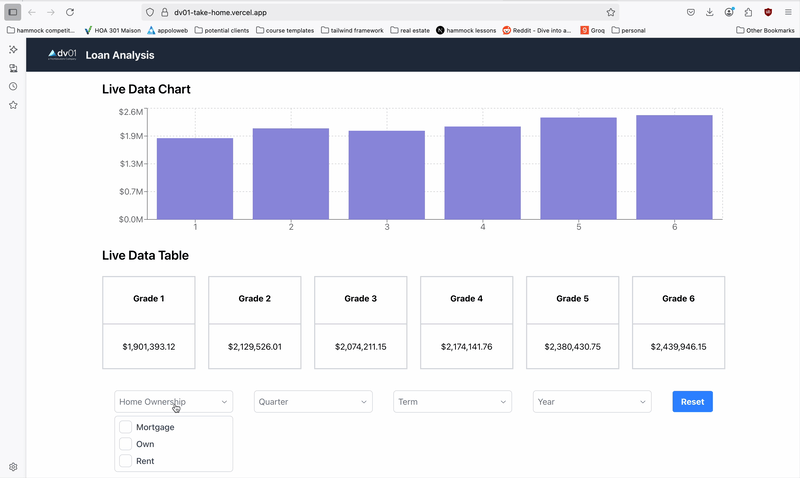

# DV01 Take-Home Project notes

- I removed React Scripts due to several compatibility issues and upgraded the project to React 18, since many of the old libraries were deprecated and I ran into issues testing some specs.
- Instead of relying on a component library, I built a custom multi-select control. In a production setting I’d normally use shadcn, but overriding its existing components felt like overkill. I also integrated Storybook to showcase the new control.
- You will need to be on node 18.18 at a minimum, I didn't test later versions as that's what's currently on my machine, but all previous versions caused compatibility issues.
- I implemented the chart, and the filters and they work dynamically. I wanted to changed the layout but I tried to stick to the wireframe as close as i could. With more time, I’d add URL query parameters so that user filters persist after a page refresh as well as making the page accessbile.
- I tested the happy path of cases, as I didn't see any instructions where I'd need to account for bad data
- I also did not make it responsive, as I wasn't sure how much liberty outside of the wireframe I would have.

## Preview

I deployed the project because I wanted to ensure it was projection ready. You can access it here: https://dv01-take-home.vercel.app/

In the event the vercel is down here's a gif:



## Table of Contents

- [Prerequisites](#prerequisites)
- [Getting Started](#getting-started)
  - [Installation](#installation)
- [Available Scripts](#available-scripts)
- [Project Structure](#project-structure)
- [Features](#features)
- [Tech Stack](#tech-stack)
- [Development](#development)
- [Testing](#testing)
- [Appendix](#appendix)
  - [Common Issues and Solutions](#common-issues-and-solutions)
  - [Development Tips](#development-tips)
  - [Code Quality](#code-quality)
  - [Project Dependencies](#project-dependencies)
  - [Contributing](#contributing)
  - [License](#license)

## Prerequisites

- Node.js >= 18.18.0
- Yarn package manager

## Getting Started

1. Clone the repository:

```bash
git clone git@github.com:latifahpresident/dv01_take-home.git
cd dv01_take-home
```

2. Install dependencies:

```bash
yarn install
```

if you run into installaation issues try

```bash
yarn install --ignore-engines
```

3. Start the development server:

```bash
yarn dev
```

The should automatically open to `http://localhost:3000`

## Available Scripts

- `yarn dev` - Start the development server
- `yarn build` - Build the application for production
- `yarn preview` - Preview the production build locally
- `yarn storybook` - Start Storybook development server
- `yarn build-storybook` - Build Storybook for production
- `yarn test` - Run Jest tests

## Project Structure

```
src/
├── components/     # Reusable UI components
├── services/      # API and data services
├── utils/         # Utility functions
└── assets/        # Static assets and styles
```

## Features

- Interactive data visualization using Recharts
- Multi-select filtering capabilities
- Responsive design
- Component documentation with Storybook

## Tech Stack

- React 18
- TypeScript
- Vite
- TailwindCSS
- Recharts
- Storybook
- ESLint & Prettier
- Husky for git hooks

## Development

The project uses several development tools:

- ESLint for code linting
- Prettier for code formatting
- Husky for git hooks
- Storybook for component documentation

## Testing

The project uses Jest and React Testing Library for testing. Tests are located alongside the components they test with the `.test.tsx` extension.

To run tests:

- `yarn test` - Run all tests once

The test setup includes:

- Jest for test running and assertions
- React Testing Library for component testing
- Jest DOM for DOM-specific assertions
- TypeScript support via ts-jest

## Appendix

### Common Issues and Solutions

1. **Installation Issues**

   - If you encounter Node.js version compatibility issues, try using `yarn install --ignore-engines`
   - For TypeScript compilation errors, ensure you're using Node.js >= 18.18.0

2. **Development Tips**

   - Use `yarn dev` for local development
   - Storybook is available at `http://localhost:6006` when running `yarn storybook`
   - The development server runs on `http://localhost:3000`

3. **Code Quality**

   - ESLint and Prettier are configured to maintain code quality
   - Husky pre-commit hooks ensure code quality before commits
   - Run `yarn test` before submitting PRs

4. **Project Dependencies**
   - React 18 for UI components
   - Recharts for data visualization
   - TailwindCSS for styling
   - TypeScript for type safety
   - Jest and React Testing Library for testing

### Contributing

1. Create a new branch for your feature
2. Write tests for new functionality
3. Ensure all tests pass
4. Submit a pull request
